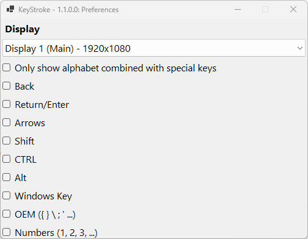

# ⌨️ KeyStroke
> **The elegant, lightweight keystroke visualizer for Windows.** > *Perfect for tutorials, screen recordings, presentations, and live streaming.*

  

## 🚀 Overview
**KeyStroke** is a standalone utility that displays your currently pressed keys in a sleek, non-intrusive overlay on your screen. 

Whether you are a teacher conducting a coding workshop, a YouTuber recording a software tutorial, or a streamer showing off gaming mechanics, KeyStroke ensures your audience never misses a beat. It is designed to be **minimalist yet powerful**, fading away when not in use and intelligently handling complex key combinations.

## ✨ Key Features
* **🎯 Smart Visualization:** Automatically detects and formats shortcuts (e.g., `Ctrl + C`, `Shift + Alt + Del`).
* **🖥️ Multi-Monitor Support:** Choose exactly which screen the overlay appears on—perfect for dual-monitor setups.
* **🧠 Intelligent Filtering:** Option to "Only show combined keys" to keep the screen clean (hides normal typing, shows shortcuts only).
* **🎨 Smooth Animations:** Features elegant fade-in/out effects to minimize distraction.
* **⚡ Anti-Ghosting:** Prevents spamming visual noise when holding down a key (ignores auto-repeat).
* **🛠️ Highly Configurable:** Toggle display for specific groups like:
    * Arrow Keys
    * Numpad
    * Function Keys
    * OEM Keys (`{ } \ ; '`)
    * Windows Key (`❖`)

## 📥 Installation
1.  Go to the [**Releases**](https://github.com/drarahimi/KeyStroke/releases) page.
2.  Download the latest `KeyStroke.exe`.
3.  Run the application (No installation required—it's portable!).

> **Note:** KeyStroke minimizes to the system tray. Double-click the tray icon to change settings or exit.

## ⚙️ Configuration
KeyStroke offers a granular settings menu allowing you to customize exactly what your audience sees.

  

### Settings Explained
| Setting | Description |
| :--- | :--- |
| **Display** | Select which monitor the OSD (On-Screen Display) should appear on. |
| **Only show... combined** | **Highly Recommended.** If checked, regular typing (a, b, c) is hidden. The OSD only triggers when you use a modifier (e.g., `Ctrl+S`). |
| **Return/Enter** | Toggle visibility for the Enter key. |
| **OEM** | Toggle visibility for syntax characters like brackets and semicolons. |

## 🤝 Contributing
Contributions, issues, and feature requests are welcome! 
Feel free to check the [issues page](https://github.com/drarahimi/KeyStroke/issues).

## 📜 License
This project is licensed under the MIT License - see the [LICENSE](LICENSE) file for details.

---

  Make by <a href="https://github.com/drarahimi">Dr. Afshin Rahimi</a>

